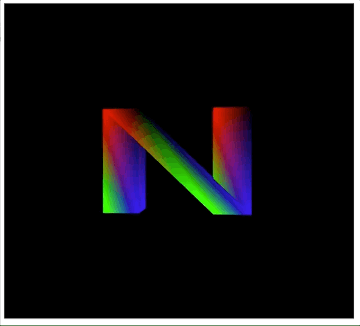

# rotating-alphabet

A simple WebGL exapmple giving the HTML canvas tag

### Steps in brief
1. Create a canvas tag
2. Define the alphabet geometry
3. Create Vertex Buffer
4. Store geometry to ___vertex buffer___
5. Create and store to ___color buffer___
6. Add Shaders
7. Rotate about Y axis 

